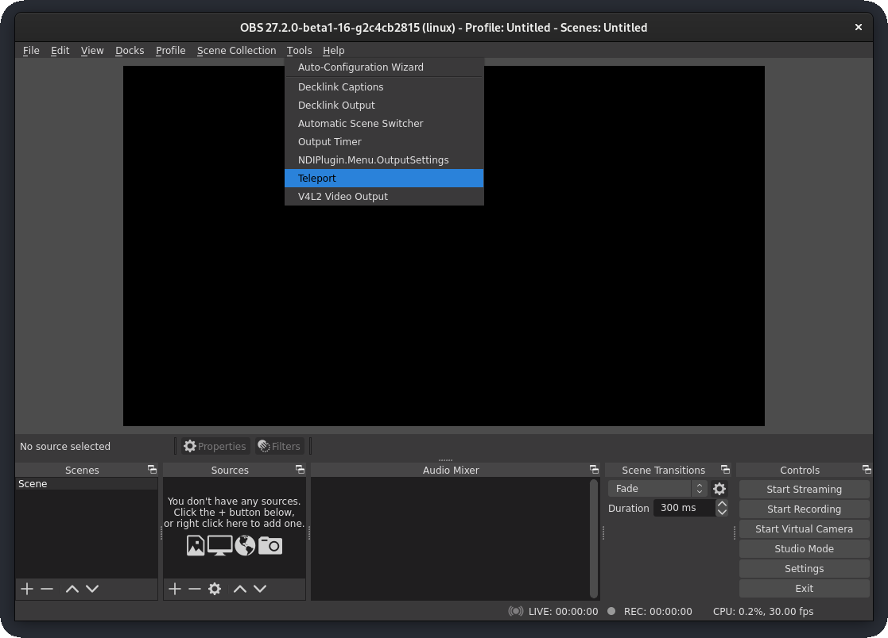
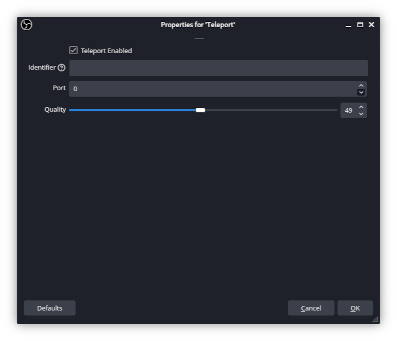
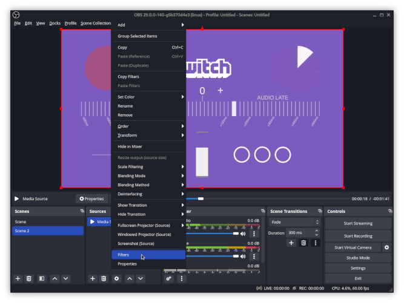
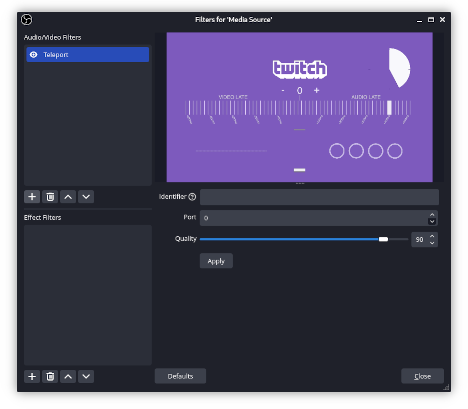
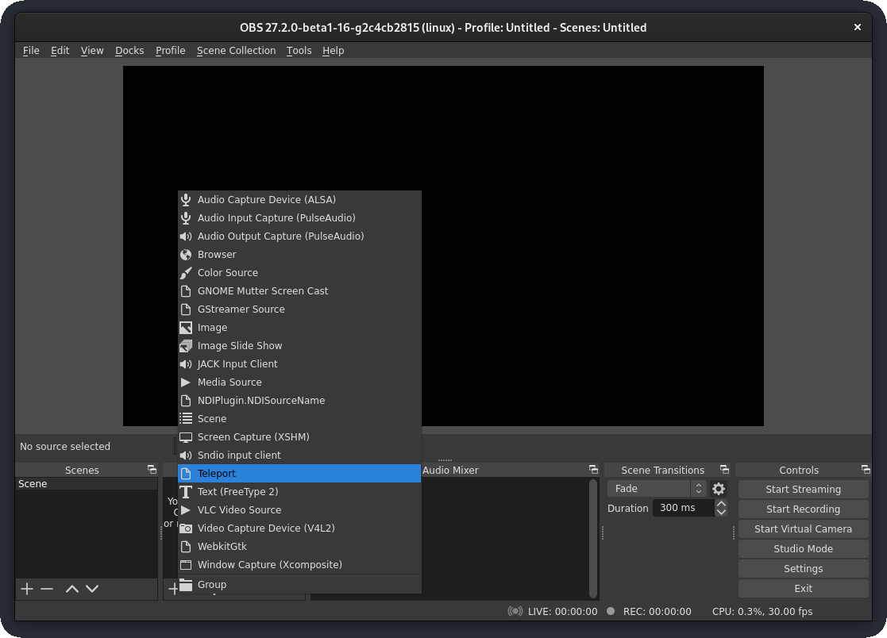
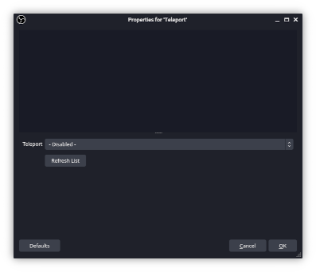

# OBS Teleport

An [OBS Studio] plugin for an open [NDI]-like replacement. Pretty simple, straight forward. No NDI compatibility in any form.

Just as an alternative option for stream setups with multiple machines wanting to transmit some OBS Studio scenes to the main streaming machine in LAN.

[OBS Studio]: https://obsproject.com
[NDI]: https://ndi.tv/

## Notes

Obviously a network connection must be made between sender and receiver. So they must be on the same network for peer discovery. In case discovery is working, but no video or audio is transmitted make sure to disable the network firewall on the sender.

As of now only the Audio/Video filter mechanic is implemented on the filter feature. Adding it as an effect filter is currenlty not supported. Revert to the output mode in this case.

## Installation

Please refer to the OBS Studio documentation on how and where to install plugins. There are too many platforms and installation options available as the scope of this project could explain and maintain.

Check here for a starting point:

https://obsproject.com/forum/resources/obs-and-obs-studio-install-plugins-windows.421/

Binaries can be grabbed from the [Releases] section.

[Releases]: https://github.com/fzwoch/obs-teleport/releases

## Setup Sender

Go to `Tools → Teleport`.

Check `Teleport Enabled`.

## Setup Sender as Audio/Video Filter

Click `<Source> Right click → Filters`.

Click `+ → Teleport`.

## Setup Receiver

In your Scene do `Sources → Add → Teleport`.

Select a detected stream from the `Teleport` drop down.

